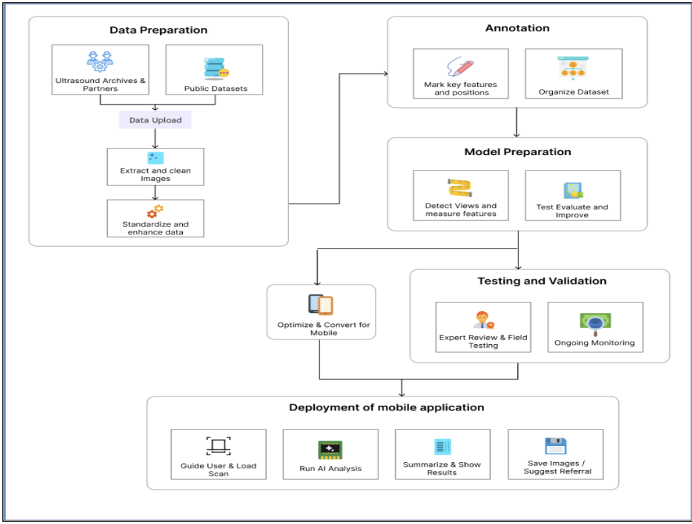

# 🩺 Natalis – AI-Powered Prenatal Diagnostic Ecosystem

Natalis is a **mission-critical medical platform** designed to democratize prenatal ultrasound screening. By integrating a **Flutter mobile application**, a **Spring Boot 4.0 service layer**, and a **PyTorch-based AI engine**, Natalis automates fetal biometry—providing instant clinical insights such as **Head Circumference (HC)** and **Gestational Age (GA)**, even in low-resource environments.

---

## 🏛️ System Architecture

<p align="center">

  

</p>

Natalis follows a **three-tier architecture** to ensure scalability, security, and clinical-grade accuracy.

---

## 1️⃣ Client Layer – Flutter Mobile App

The primary interface for clinicians and patients, built for high-performance cross-platform deployment.

### 🔹 Key Features

- **Role-Based Workflows**
  - 👨‍⚕️ Doctor Portal – Test management, biometry trigger, clinical review
  - 👩 Patient Portal – Scan history, reports, notifications

- **Material 3 UI**
  - Modern tactile interface  
  - Modal-driven data entry  
  - Optimized keyboard compatibility  

- **Core Modules**
  - Splash & onboarding screens  
  - Interactive dashboards  
  - Real-time notification support  

---

## 2️⃣ Service Layer – Spring Boot Backend

The secure and scalable **Enterprise Core** of Natalis.

### 🔹 Tech Stack

- Java 21  
- Spring Boot 4.0.1  
- MongoDB  
- Maven  

### 🔹 Security & Reliability

-  Google OAuth 2.0 Authentication  
-  Bucket4j API Rate Limiting  
-  MongoDB for flexible patient record storage  
-  Fully containerized using Docker for cloud-native deployment  

---

## 3️⃣ Intelligence Layer – Python AI Engine

The diagnostic **AI brain** optimized for medical-grade precision.

### 🔹 Model Architecture

- DeepLabV3+ segmentation model  
- timm-efficientnet-b4 backbone  

### 🔹 Optimization Pipeline

- Learnable Resizer for edge-preserving downsampling  
- DenseCRF refinement  
- Test-Time Augmentation (TTA)  
- Largest Connected Component (LCC) filtering  

---

## 📊 Clinical Biometry & Medical Logic

Natalis converts AI segmentation outputs into clinically actionable measurements using international growth standards.

---

### 🧠 Head Circumference (HC) Calculation

An ellipse is fitted using a least-squares method on the predicted mask.

Ramanujan II Approximation is used to compute circumference:

```

HC ≈ π [3(a + b) − √((3a + b)(a + 3b))]

```

Where:

- `a` = Semi-major axis  
- `b` = Semi-minor axis  

---

### 📅 Gestational Age (GA) Estimation

- Based on the **Intergrowth-21st standard**
- HC measurement is mapped to gestational age in:
  - Weeks
  - Days  

This enables accurate fetal growth tracking.

---

### ⚠️ Abnormality Classification

Using **NICHD Fetal Growth Study** percentile data (ethnicity-specific):

| Classification | Condition |
|---------------|----------|
| Microcephaly  | HC < 3rd percentile |
| Normal        | HC between 5th – 95th percentile |
| Macrocephaly  | HC > 97th percentile |

Supported ethnic categories:

- White  
- Black  
- Hispanic  
- Asian  

---

## 📂 Project Structure

```

├── natalis_frontend/       # Flutter Mobile Application
│   ├── lib/                # UI Screens, Widgets, Models
│   └── pubspec.yaml        # Mobile dependencies
│
├── natalis_backend/        # Spring Boot API (Java 21)
│   ├── src/                # Controllers, Services, Security
│   ├── pom.xml             # Maven dependencies
│   └── Dockerfile          # Docker build script
│
├── ai_engine/              # Python Intelligence Core
│   ├── model.py            # DeepLabV3+ Architecture
│   ├── age_cal.py          # HC & GA Calculations
│   ├── abnormality.py      # Growth Chart Logic
│   └── configs.py          # Pixel-to-MM Calibration

````

---

## 🚀 Installation & Deployment

### 🔹 1. Backend (Docker)

```bash
cd natalis_backend
docker build -t natalis-backend .
docker run -p 8080:8080 natalis-backend
````

---

### 🔹 2. AI Engine

```bash
cd ai_engine
pip install -r requirements.txt
```

---

### 🔹 3. Mobile App

```bash
cd natalis_frontend
flutter pub get
flutter run
```

---

## 🛠️ Tech Stack Summary

| Layer    | Technologies                                       |
| -------- | -------------------------------------------------- |
| Frontend | Flutter, Dart, Material 3                          |
| Backend  | Java 21, Spring Boot, MongoDB, Maven               |
| AI/ML    | PyTorch, OpenCV, Pandas, Segmentation Models (SMP) |
| DevOps   | Docker, Google Cloud, Bucket4j                     |

---

## 🌍 Vision

Natalis aims to:

* Democratize prenatal diagnostics
* Enable AI-assisted fetal screening in low-resource settings
* Deliver secure, scalable, and clinically reliable ultrasound analysis

```
